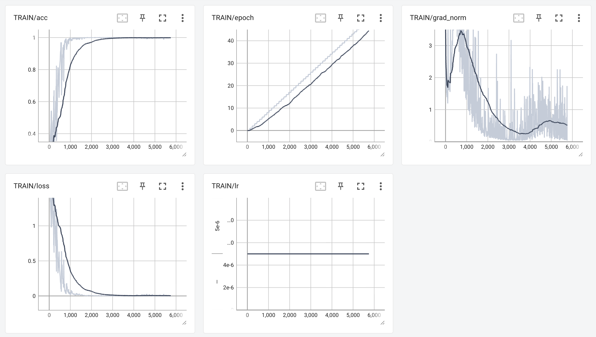

# CosyVoice2 微调：恋与深空秦彻语音

基于 CosyVoice2 对恋与深空中的秦彻角色语音进行 SFT（监督微调），得到可复现该音色的 TTS 模型。

## 1. 环境配置

- Python >= 3.10
- CUDA（训练与推理需 GPU）
- 依赖见 `pyproject.toml`，推荐使用虚拟环境安装：

```bash
cd /path/to/cosyvoice-qinche-sft
pip install -e .
# 或 uv / pip 根据 pyproject.toml 安装
```

运行前需执行 `source path.sh`（或由 `run.sh` 自动 source），以设置 `PYTHONPATH`（含本项目及 `third_party/Matcha-TTS`）。

## 2. 目录结构概览

```
cosyvoice-qinche-sft/
├── run.sh                 # 主流程脚本（stage 0～7）
├── path.sh                # 环境与 PYTHONPATH
├── pyproject.toml         # 依赖与项目信息
├── conf/
│   ├── cosyvoice2-qinche.yaml   # 秦彻微调配置（模型结构、数据 pipeline、训练超参）
│   ├── cosyvoice2.yaml          # 基础配置
│   └── ds_stage2.json           # DeepSpeed 配置（可选）
├── local/
│   └── prepare_data.py    # Stage 0：成对 wav/txt → Kaldi 风格表文件
├── tools/
│   ├── extract_embedding.py     # Stage 1：CAM++ 说话人嵌入
│   ├── extract_speech_token.py  # Stage 2：语音离散 token
│   ├── make_parquet_list.py     # Stage 3：生成 parquet 与 data.list
│   └── save_spk2info.py         # Stage 4：写入 spk2info.pt 到模型目录
├── cosyvoice/             # CosyVoice 核心代码（LLM / Flow / 数据处理等）
├── my_inference/           # 推理脚本（sft_inference、zero-shot 等）
├── examples/
│   └── my_tts_text.json   # 推理用文本（需包含与 spk_id 同名的 key，如 qinche）
├── data/                  # 数据与中间结果（见下方「数据与配置」）
└── exp/                   # 训练 checkpoint（由 run.sh 写入）
```

## 3. 微调数据集准备

### 3.1 数据处理流程

从B站下载[秦彻语音合集，并按照下面的流程进行处理：](https://www.bilibili.com/video/BV1jieteQEmC/?vd_source=03c34461e4aa6d2b57aa2b6fada6e5c4&p=2)

```Markdown
原始长音频目录 (如 Sertua/)
    │  1_1.wav, 1_2.wav, 1_10.wav, ...
    ▼
┌─────────────────────────────────────────────────────────────────┐
│ 步骤 1：按静音切分 (split.py)                                      │
│ 每个长音频按静音区间切成多段短音频                                    │
└─────────────────────────────────────────────────────────────────┘
    ▼
qinche_data/
    ├── 1_1/   → 1.mp3, 2.mp3, 3.mp3, ...
    ├── 1_2/   → 1.mp3, 2.mp3, ...
    ├── 1_10/  → ...
    └── ...
    ▼
┌─────────────────────────────────────────────────────────────────┐
│ 步骤 2：语音转文本 (extract_text_from_audio.py)                   │
│ 对每个短音频做 ASR，生成同名 .txt                                   │
└─────────────────────────────────────────────────────────────────┘
    ▼
qinche_data/1_1/
    ├── 1.mp3, 1.txt
    ├── 2.mp3, 2.txt
    └── ...
    ▼
┌─────────────────────────────────────────────────────────────────┐
│ 步骤 3：删除过短文本及对应音频 (remove_short_txt_and_audio.py)       │
│ 文本字符数 < 4 的条目：删除其 .txt 与同名音频                         │
└─────────────────────────────────────────────────────────────────┘
    ▼
最终结果：每个子目录内仅保留「文本不少于 4 字」的 音频 + .txt 对
```


1. 步骤 1：按静音切分 ([split.py](http://split.py))
  - 使用 `pydub` 的 `detect_silence` 检测静音段（参数：最小静音长度 300ms，静音阈值 -35dB）。
    - 在相邻静音段中点处切分，得到多段「有声音频」。
    - 支持格式由扩展名推断：`.wav` / `.mp3` / `.flac` / `.ogg` / `.m4a` / `.aac`。
2. 步骤 2：语音转文本 (extract_text_from_audio.py)
  - 对**指定目录内**的音频文件做语音识别，为每个音频生成**同名 .txt**（内容为识别文本）。
    - 默认输出与音频同目录；也可通过 `--txt_dir` 指定单独 txt 目录。
    - 识别后端：
      - **funasr**（默认）：SenseVoiceSmall，中文识别并带标点，推荐。
      - **whisper**：Whisper，可选 `--model_size`（tiny/base/small/medium/large），可配合 FunASR 标点模型做标点恢复。
3. 步骤 3：删除过短文本及对应音频 (remove_short_txt_and_audio.py)
  - 在**指定目录**内，找出「文本内容（strip 后）字符数 < N」的 .txt（默认 N=4）。
    - 删除这些 .txt 以及**同名**的音频文件（按 .mp3 / .wav / .flac / .m4a / .ogg 匹配）。

处理完后的数据集统计信息如下：


| 项目          | 数量                           |
| ----------- | ---------------------------- |
| 总数据量        | 1788 条（每条 = 1 个音频 + 1 个对应文本） |
| 训练集 (train) | 1455 条                       |
| 测试集 (test)  | 333 条                        |


### 3.2 数据格式

- **根目录**由 `run.sh` 中 `data_dir` 指定（示例：`data/tts-data`）。
- 其下需有 **train** 与 **test** 两个子集，每个子集内为「成对」的：
  - `*.wav`：音频（建议 24kHz，单声道；过长会被脚本或模型截断）
  - `*.normalized.txt`：与 wav 同名的文本，扩展名为 `.normalized.txt`  
  例如：`1_1000.wav` 对应 `1_1000.normalized.txt`。
- **说话人 ID**：由 `local/prepare_data.py` 从文件名推断，为**第一个下划线前的部分**（如 `1_1000` → 说话人 `1`）。若希望秦彻单独一个 ID，可统一用同一前缀（如 `qinche_xxx.wav`）.

### 3.3 推理用文本（examples/my_tts_text.json）

推理脚本会按 `spk_id` 取 JSON 中对应 key 的文本列表。当前示例为 `paimon`，做秦彻推理时需增加 `qinche` 键，例如：

```json
{
  "paimon": { ... },
  "qinche": {
    "sft_inference": [
      "你要的秦彻试听句子一。",
      "你要的秦彻试听句子二。"
    ]
  }
}
```

---

## 4. run.sh

run.sh 是本项目的主流程脚本，包含 7 个 stage，分别是：

| Stage | 说明                                                                                                                                            |
| ----- | --------------------------------------------------------------------------------------------------------------------------------------------- |
| **0** | **数据准备**：将 `data_dir/{train,test}` 下成对 `.wav` 与 `.normalized.txt` 整理成 Kaldi 风格表文件（wav.scp、text、utt2spk、spk2utt），输出到 `data/train`、`data/test`。 |
| **1** | **说话人嵌入**：用 CAM++ ONNX 提取每条/每个说话人 embedding，得到 `utt2embedding.pt`、`spk2embedding.pt`。                                                         |
| **2** | **语音离散 token**：用 speech_tokenizer_v2.onnx 生成 `utt2speech_token.pt`。                                                                           |
| **3** | **Parquet 与 data.list**：将上述特征打成 parquet，并生成 `data.list`，供训练读取。                                                                                |
| **4** | **说话人信息写入模型目录**：把当前 `spk_id` 的 embedding 写成 `spk2info.pt`，写入 `output_model_dir` 下 llm、flow、llm_flow；若目录为空会先复制预训练权重。                           |
| **5** | **微调**：按 `conf/cosyvoice2-qinche.yaml` 训练 LLM（及可选 flow），使用 `data/train.data.list`、`data/dev.data.list`，推理试听写入 `output/${spk_id}_inference`。   |
| **6** | **模型平均**：对 llm / flow 的 checkpoint 做平均，得到最终 `llm.pt` / `flow.pt`。                                                                             |
| **7** | **导出**：将 `output_model_dir` 下模型导出为 JIT / ONNX，便于推理加速。                                                                                         |


可通过 `stage` 与 `stop_stage` 控制范围，例如只跑数据预处理：

```bash
stage=0 stop_stage=4 bash run.sh
```

只跑微调（需先完成 0～4 并生成 parquet）：

```bash
stage=5 stop_stage=5 bash run.sh
```

## 5. 微调结果

运行 `stage=5 stop_stage=5 bash run.sh` 后，会在 `exp/cosyvoice2/llm/torch_ddp` 下生成 checkpoint，并在 `tensorboard/cosyvoice2/llm/torch_ddp` 下生成 tensorboard 日志。



语音复刻效果：

[试听：qinche_sft_inference_0.wav](./output/qinche_inference/llm/qinche_sft_inference_0.wav)